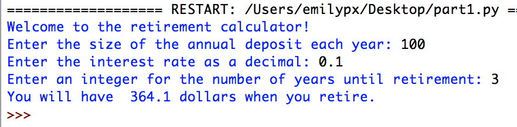
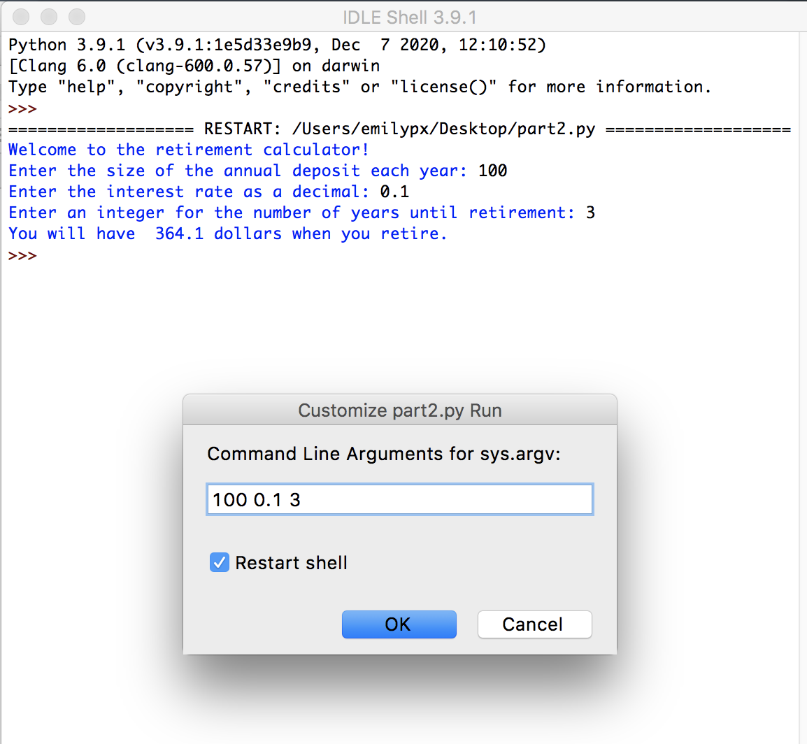
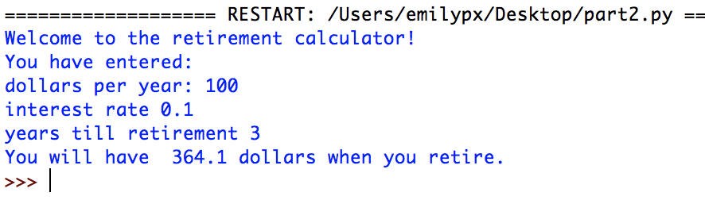
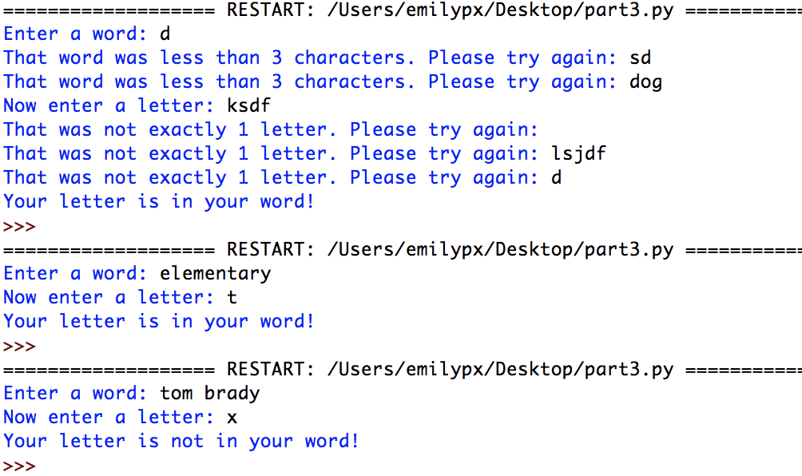

# Problem Set 3

### Due Monday 9/19 @ 11:59pm EDT

For this problem set, you will submit to Canvas **a single .zip file**. Detailed instructions for what the .zip file should contain are at the end of this problem set. Note that if you do not submit the files as specified here, there will be a major deduction in your grade for this assignment. Following directions to the letter is a crucial skill for computer programming.

**NEW!** I now expect you to write comments in your code! One point will be deducted if you do not provide comments explaining your code. Here's what I would like commented this time:

* Before every function, describe what it does and what its arguments are (if any).
* Before every variable, explain what value it is holding.

And, as always, in every program, the first four lines (comments) should be:

* The name of the file.
* Your name.
* The date.
* A statement saying "This code is my own work. I did not share my code or look at the code of another student."

## Getting started

In your `CS1` folder you created for the previous problem set, create a folder called `ps3`. At the end of this problem set, you will put all of the components required for this problem set in the `ps3` folder, which you will then zip up and submit as a `.zip` file to Canvas, just as you did for PS2.

## Part 1
In Part 1, you will build a financial calculator that can be used to calculate the future value of a retirement account. This is an idealized retirement account, where each year the person deposits the same amount of money on January 1, and the same interest rate is applied to the balance on December 31.

For example, suppose you deposit $100.00 per year for three years in a retirement account that earns 10% interest. On January 1 of year 1, you deposit your $100. On December 31, you will earn $10.00 interest (i.e., 10% of $100.00) giving you a balance of $110.00 after 1 year. On January of year 2 you will deposit another $100.00, giving you a balance of $210.00. Then, on December 31 of year 2, you will earn $21.00 interest (i.e., 10% of $210.00) giving you a balance of $231.00 after 2 years. On January 1 of year 3, you again deposit $100.00, giving you $331. On December 31, interest is calculated ($33.10) and added to the current balance ($331), giving you $364.10. 

Your program will be called `part1.py` and will do the following, **without using functions**:

1. Print a message explaining that it is a retirement calculator and will be asking some questions.
2. Prompt the user to enter the size of the annual deposit in dollars.
3. Prompt the user to enter the interest rate **as a decimal** (so 10% would be 0.10).
4. Prompt the user to enter the number of years until retirement **as an integer**.
5. **Using a `for` loop,** calculate the  value of the retirement account when the user retires.
6. Print the  value of the retirement account when the user retires.

You can check your math with this handy calculator, entering 0 for the `Current principal`.

http://www.moneychimp.com/calculator/compound_interest_calculator.htm

Here is a sample run of the program:

Put `part1.py` in your `ps3` folder.

## Part 2
In part 2, you will create a program that does just what the program in Part 1 did but in a different way. 

**First difference:**
Instead of getting user input while the program is running, the size of deposit, interest rate, and number of years until retirement will be provided as command line arguemnts. When a user runs the program, they will use the `Run... Customized` option, and they will enter the three data points as three command-line arguments. **(Don't forget to `import sys`!)** Here's a picture of how you will put in the arguments with `Run... Customized``:

**Second difference:**
In `part2.py` you will do the work with **2 functions**: a `main()` function and a function called `calculate()`. 

* The `calculate()` function will take three arguments:

1. The size of the annual deposit.
2. The interest rate.
3. The number of years until retirement.

It will then perform the calculation you carried out in Part 1, but this time, **you will use a `while` loop**. As before you will print out the value of the account when the user retires. It should give the same result as Part 1, of course.

* The `main()` function will read the commandline arguments into three variables of the correct type. It will then call the `calculate()` function with these three variables.

Here is a sample run of the program:

Put `part2.py` in your `ps3` folder.

## Part 3
In part 3, you will create a new program called `part3.py` that will do the following **in a `main()` function**:

1. Prompt user to enter a word. Check to make sure that it is longer than 2 characters. If it is not, ask the user to try again. While the user enters something less than 2 characters, keep telling them it's too short and keep asking them to try again. You will use a `while` loop to do this.

2. Prompt user to enter a single letter. Check to make sure that it is a single character. Again, if it's not exactly one character, keep telling them you want exactly one letter and keep asking them to try again. Again, you will use a `while` loop to do this.

3. Report back to the user whether the word they entered contains the letter they entered.

Here are a few sample runs of the program:

---

## What to turn in
In your `ps3` folder you should have three python scripts: `part1.py`, `part2.py`, and `part3.py`. Remove any other things you might have accidentally put in the folder, then zip the folder up using whatever means you normally use to zip things up (e.g., on a Mac, you can right click and select `Compress`).

Upload the `.zip` file you created to Canvas. 

Note that if you do not submit the files as specified here, there will be a major deduction in your grade for this assignment. Following directions to the letter is a crucial skill for computer programming.

**Don't forget your comments!**

### This problem set is due Monday 9/19 @ 11:59pm EDT

